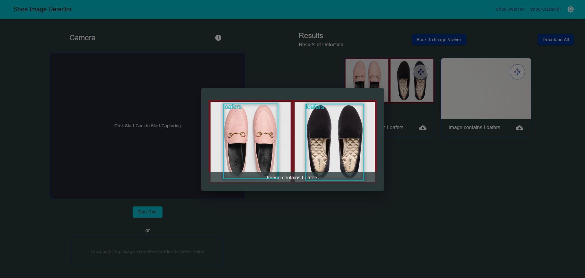

# Edgenet Shoe Classification Web Application Challenge Solution Writeup

Topcoder, in partnership with [AlefEdge](https://alefedge.com/?utm_source=topcoder&utm_medium=link&utm_campaign=edgevscloud), has recently launched multiple Development Challenges as part of the [EdgeNet](https://www.topcoder.com/community/member-programs/edgenet) program. I was, fortunately, able to be a part of one such challenge, the [Shoe Image Classification Challenge](https://www.topcoder.com/challenges/0ba48ad2-6bda-406b-a430-ecdc4d6964aa), and got placed first :). In this post, I'll discuss my solution, in brief, explaining my approach to different requirements and problems that occurred during the development of the application.

## Understanding the Requirements

The main objective of this challenge was to develop a web application for Shoe Image Classification. An existing shoe image classification model had been provided as a starter code. The app would allow the users to use a webcam to upload image(s) to the backend, which then will classify the image(s) uploaded using the provided model and displays the result(s) of classification on the frontend. An optional requirement of creating a localization model, which would draw bounding boxes around the shoe in the image, was also listed, along with its bonus prize money. Full details are available in the [challenge spec](https://www.topcoder.com/challenges/0ba48ad2-6bda-406b-a430-ecdc4d6964aa).

## Choice of Technology Stack

The provided code for the classification model used PyTorch for classification and inference, thus the backend needed to be in Python. For the front end, we were free to use open-source libraries and frameworks. After carefully evaluating the requirements, and based on my experience, I chose the following tech stack:

- Frontend: **ReactJS**
  - Material UI as styling library
  - Redux for state management
  - React Webcam for capturing webcam images
  - React Konva for drawing bounding boxes
- Backend: **Django**, with the following libraries
  - Django Rest Framework: For creating a REST API
  - PyTorch for classification inference
- Localization Model
  - PyTorch for training and inference
- Docker and Docker Compose

## Working on the Backend

Starting with the backend, I worked on the API and image handler part of the requirements. Django Rest Framework provides the basic setup and tools necessary to create API endpoints using just a few lines of code.

```python
# classifier/app.py
class ClassifyShoeImageAPIView(generics.GenericAPIView):
    parser_classes = (parsers.MultiPartParser,)

    def post(self, request, *args, **kwargs):
        image_files = request.FILES.getlist('images')
        preds = shoe_classification_handler.process_images(image_files)
        return response.Response({'preds': preds})

# This code demonstrates the logic followed and is not the actual code.
```

The handler is supposed to save the uploaded image to a temp location, process the image, and then delete the image. I created a generic handler class that took `tmp_folder` and the processing function (`process_img_fn`) as arguments. The `process_images` method of the handler class then took care of saving the images passed as parameters, processing them, and returning the results. This handler used Django's in-built file storage system (`FileSystemStorage`) to manage the uploaded images.

```python
# classifier/handler.py
class CustomImageHandler:

    def __init__(
            self,
            tmp_folder: Union[str, PurePath],
            process_img_fn: Callable
    ) -> None:
        self.tmp_folder = Path(tmp_folder)
        self.fs = FileSystemStorage(location=str(self.tmp_folder))
        self.process_img_fn = process_img_fn

    def process_images(self, file_obj_list: List[IO], **fn_kwargs):
        image_paths = self.move_to_tmp_batch(file_obj_list)
        preds = self.process_img_fn(image_paths, **fn_kwargs)
        self.delete_files_batch(image_paths)
        return {fname: pred for fname, pred in zip(image_paths, preds)}


shoe_classification_handler = CustomImageHandler(
    tmp_folder=settings.MEDIA_ROOT / 'classifier' / 'tmp',
    process_img_fn=classify_shoe_images
)

# This code demonstrates the logic followed and is not the actual code.
```

## Integrating Existing Classification Model with the Backend

The provided classification model was an Efficient Net B6-based classification model, with Swish Activation, trained on a custom Shoe Image Dataset. Since the classification model had been written using PyTorch, integrating with Django was quite straightforward. Import the model definition and weights and pass the images as parameters. The existing model was configured to support different options such as use CPU and GPU, batch processing, etc. using environment variables.

## Developing the Frontend

For the front end, we were given the freedom to design the UI/UX as desired. So, I proceeded with the following design

- Page divided in half:

  - Left Half: webcam feed and related features
  - Right Half: Image Previews and Results

- I also thought of some Additional Features:

  - Support for Image File upload along with webcam images.
  - Individual Image Preview Dialog/Popup
  - Support for manual deletion and selection of images before upload.
  - Downloading the results returned by the backend
  - Dark Mode (I love applications with built-in dark mode 😎)

I won't go into the details of every feature, but I'll describe some problems I faced and some approaches I used.

One major problem I faced was with selecting images to upload. Every image uploaded/captured from the webcam is stored as a base64 string in a state variable. Selecting, deselecting, deleting, passing the selected images to API, involved management of multiple states like image list, selected list, etc. For this purpose, I created a custom hook that exposes supporting functions and the store. This hook isolated the state management logic, thus making it easy to implement in React Component.

This custom hook is also available at [react-multi-select-hook](https://www.npmjs.com/package/react-multi-select-hook).

The feature of downloading the results was implemented with the `jszip` package. The downloadable zip includes all the processed images and the classification results as a CSV file. The images have a filename that contains the predicted class. This feature is mainly useful for images captured via webcam.

## Localization Model and Integrating it with the app

Along with the existing model's code, the Shoe Image Dataset used for training and validation was also provided. But this data only had classification labels. For localization/detection, the bounding box labels had to be created. For this, I manually annotated the images using [LabelImg](https://github.com/tzutalin/labelImg), an Open Source image annotation tool. Yup, I manually annotated. It took around 8-9 days of drawing rectangles on roughly 3900 images, every day for 3-4 hours🙂. But it paid off eventually I guess since I did win the bonus prize😎. The tool has an in-built feature of annotating in different standard formats, such as YOLO, PascaVOC, etc. It helped out for training on YOLOv5 Model.

For developing the detection model, I used Yolov5, pre-trained on the COCO dataset as the starting point, and fine-tuned it on the labeled and annotated Shoe Dataset. I used the training script provided by [Ultralytics/YOLOv5](https://github.com/ultralytics/yolov5). I experimented with the hyperparameters such as epochs and learning rates and model sizes (s, m, l) and got the best model at the training of the Yolov5 L model for 50 epochs.

I had initially completed the application with the classification feature. I extended the same by creating a predictor class for the object detection and passed it to the image handler in the backend. In the frontend, I added bounding boxes using `React Konva`.



## Conclusion

For deploying the application locally, I included Dockerfiles and Docker Compose for the frontend and backend services. The application was also configured to use a GPU, if available, for faster inference. Overall, the application had quite a good UX in my opinion, and the backend was also optimized to serve the results as fast as possible.
